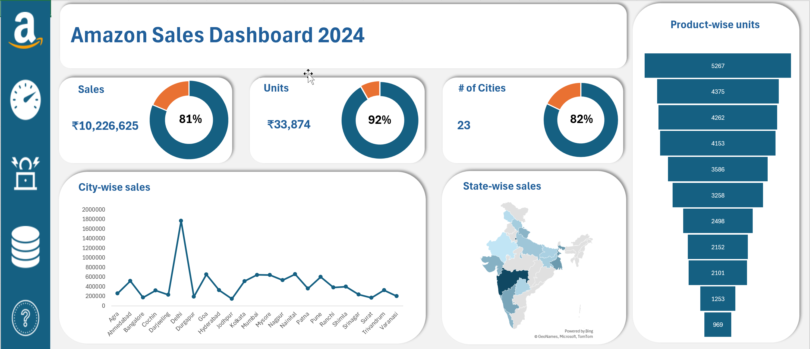

# Amazon_sales_data_Analysis

## Overview 
Welcome to my project.
In this project, i have build a dashboard fully on Excel. I have done the data cleaning, data filtering, data transforming and data visualization on a single tool that is our Excel.

### The insights we are able to seee from this dashboards are- 
- The target we have setup and the achieved target in different-different regions such as across cities and states of the country.
- The highest revenues we generated through the cities is as represented in line chart.
- The product wise units sold in the funnel chart is as like which product sold the most.

### Tools I used -
Excel

### Dashboard Image-
This is only the image for live dashboard you can go to the file "Sales Data.xlxs" and click on view raw.
- 

## Conclusion 
The result for this project is that, we have learnt the the data preparation for making dashboard withut using any tool. And gained a new experience of advanced excel charts, data modelling and data visualisation through Excel.

### Thanks for visiting my project!
